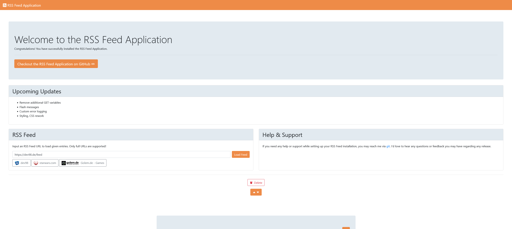

# RSS Feed Application
## Introduction

This application provides a basic RSS feed loader. All RSS feed URLs can be saved and deleted from a local file.
This allows you to load the feed at a later date. Furthermore, you can favor one single feed to load as
Default when opening the site.
<br>
<br>
Three feeds are installed by default but can be removed from the localFeed.config.json.

<br>
<br>
In the unlikely case [api.rss2json.com](https://www.api.rss2json.com) becomes unavailable, implement your own API. Parts and modules are easily replaced!

## Docker
In order to use this project correctly; you must install [Docker](https://www.docker.com).
<br>
This project uses my own custom [Linux PHP Docker Image](https://hub.docker.com/r/thehideout/php-8.0.2-apache-composer-xdebug).
<br>
<br>
<br>
<br>
<br>
<br>

## Getting Started
Use
```bash
docker-compose up
```
to start the application.

You can create your own image with the included Dockerfile. Just use --build as option for this command.
<br>

## Access Rssfeed Container
You can access the rssfeed container by using
```bash
docker-compose exec rssfeed bash
```
<br>

## Composer Dependencies
In the rssfeed container install composer dependencies
```bash
composer install
```
<br>

## Congratulations! You can now start using the application under [RSS Feed Application](http://127.0.0.1:8080)
